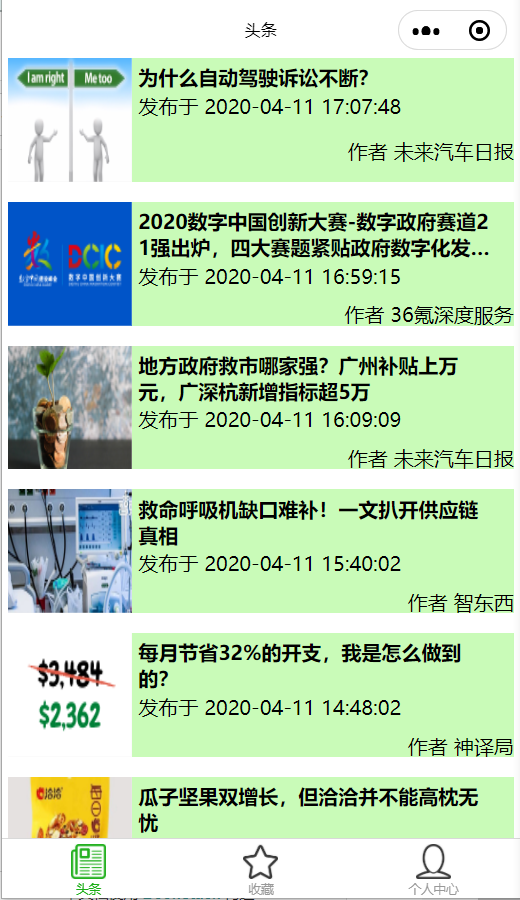
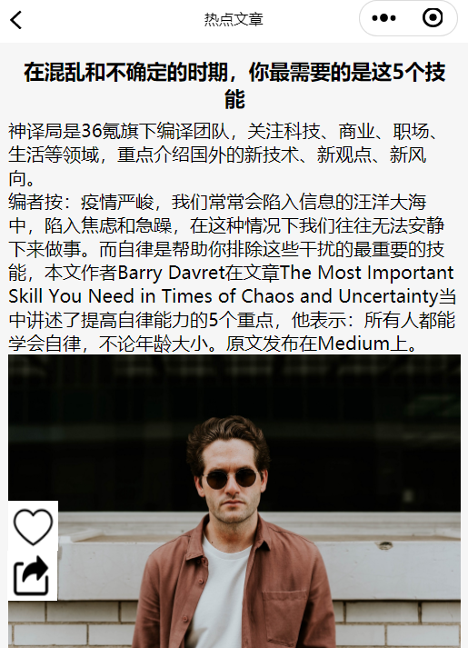
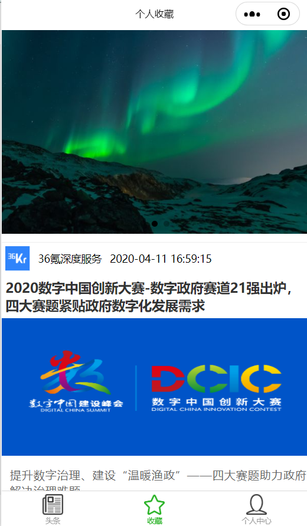
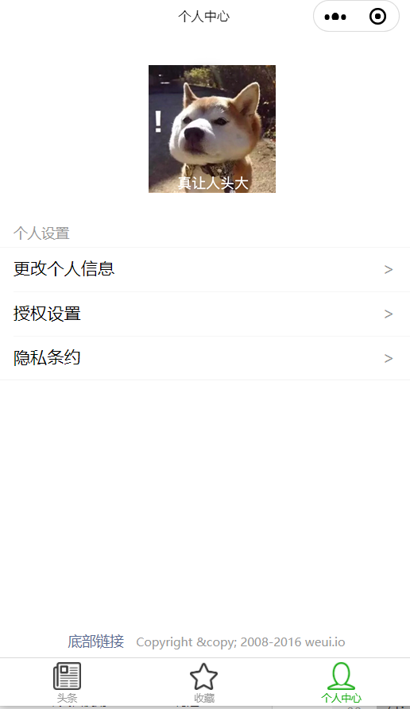

# 用云开发数据库建立的微信小程序 - 新闻列表
## 头条： 显示主要的新闻
## 收藏： 通过点击新闻详情页，可以加入收藏列表，再次点击就取消
## 分享：点击分享
## 使用的api ：
新闻列表 https://unidemo.dcloud.net.cn/api/news
（单个新闻 url: 'https://unidemo.dcloud.net.cn/api/news/36kr/'+ post_id,）

