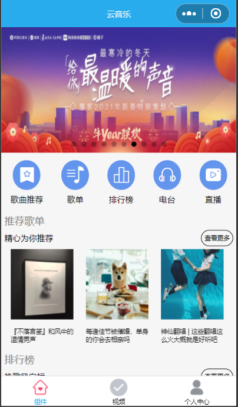
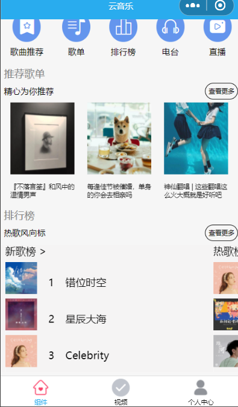
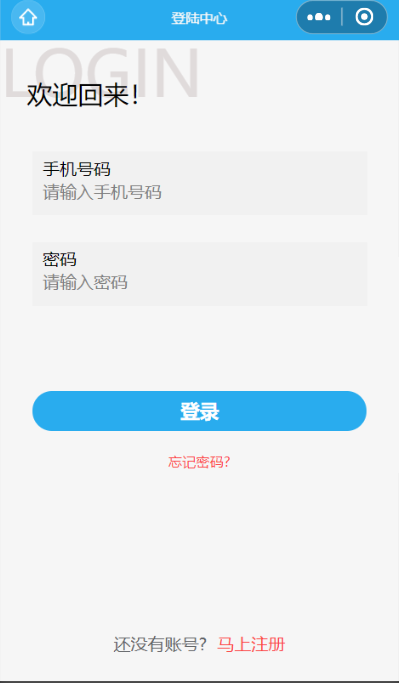
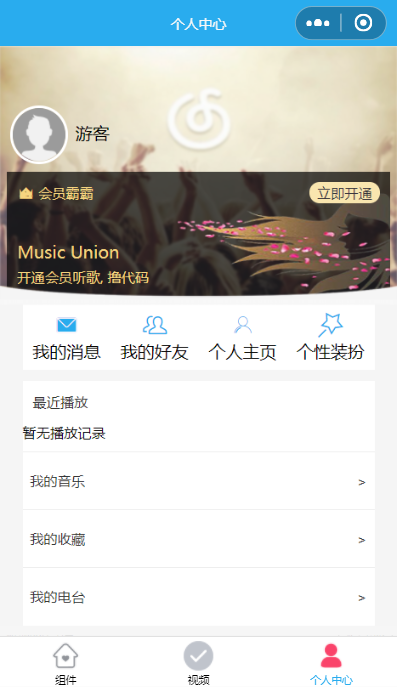
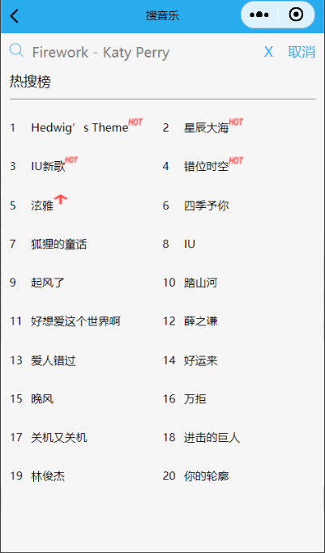
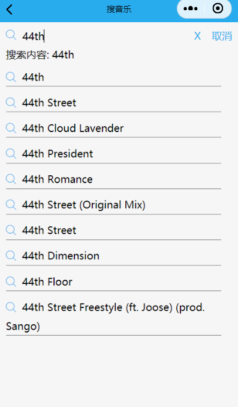
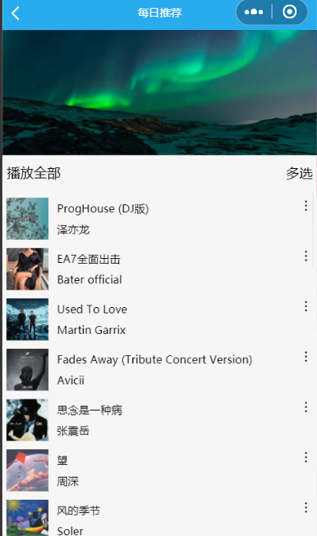
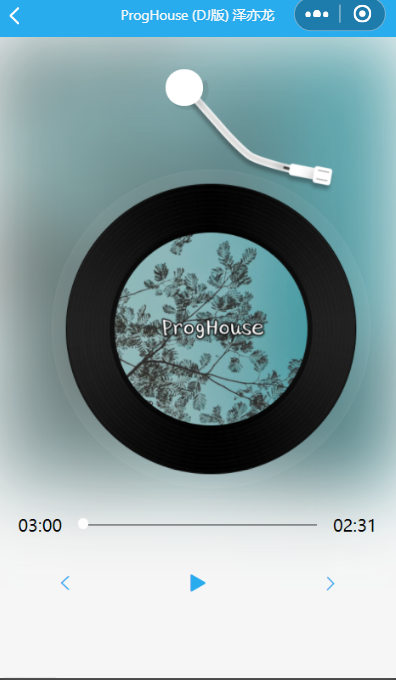

## 利用网易云api接口做的
网易云的server文件直接下载，然后运行node app.js 直接运行 （本地运行）
地址 ： https://binaryify.github.io/NeteaseCloudMusicApi/#/?id=neteasecloudmusicapi

## 文件主要的做的是基础页面以及歌曲播放

### 基本功能：
1.  获取用户说句的基本展示（动态）
2.  歌曲推荐列表
3.  个人用户登录
4.  歌曲播放 上一首 下一首 磁盘动态
5.  手机系统控制与小程序中歌曲播放互通
6.  视频播放以及优化（先用第一帧图片盖住先看到图片，点击后播放视频）
7.  搜索音乐框中搜索记录的本地缓存，模糊搜索
8.  输入框的抖动 节流 

## 歌词动态没做

# 效果图

